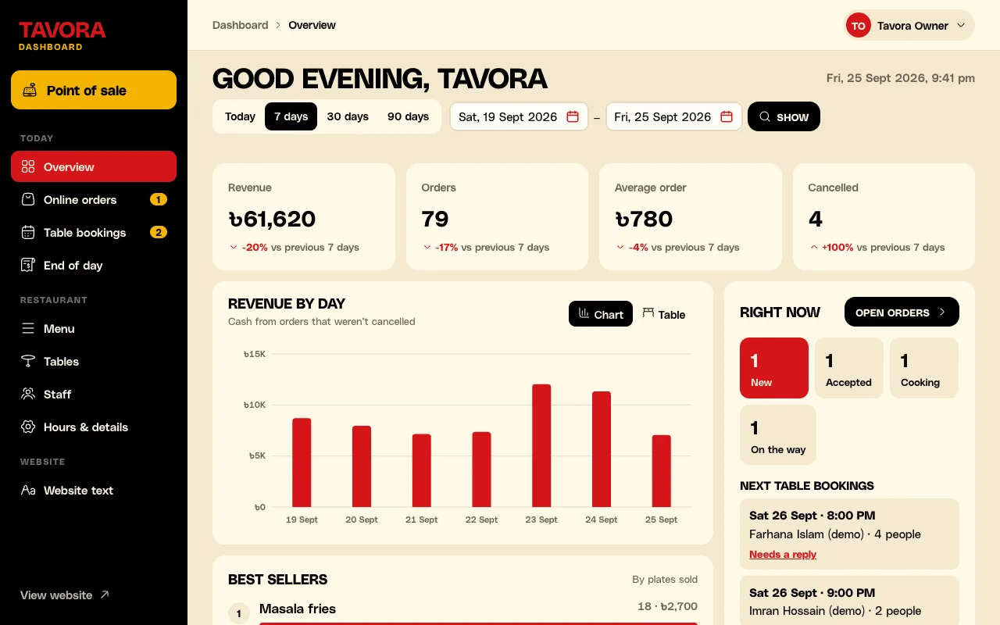

# Tavora

**A website, a dashboard and a till for restaurants in Bangladesh, all in one.**

Customers order online and pay cash on delivery. Your staff take orders at the counter on a tablet, the kitchen sees every ticket on a screen, and at night you see exactly how much cash should be in the drawer. It keeps working when the internet drops.



## What you get

| Part | What it does | Where it opens |
| --- | --- | --- |
| **Website** | Your menu, online orders (cash on delivery or pickup), table bookings, opening hours | `/` |
| **Dashboard** | Orders, bookings, menu, staff, VAT, brand colour, end-of-day report | `/admin` |
| **Till (POS)** | Tables and takeaway, kitchen screen, cash, card, bKash, Nagad, split bills, printing | `/admin/pos` |
| **Product site and docs** | What Tavora is, pricing, and a how-to guide for every screen | the `marketing/` app, docs at `/docs` |

Made for how Bangladesh works: cash on delivery first, bKash and Nagad at the till, Mushak-6.3 VAT invoices, prices in taka, Bangladesh time.

## Try it on your computer

### 1. Install these once

- [Go](https://go.dev/dl/) 1.27 or newer
- [PostgreSQL](https://www.postgresql.org/download/) 17 or newer
- [Node.js](https://nodejs.org/) 24 or newer, with [pnpm](https://pnpm.io/installation)

### 2. Start the server (the API)

```sh
createdb tavora
cd api
cp .env.example .env          # the defaults work on your computer
set -a && . ./.env && set +a
go run . create-admin you@example.com "Your Name"   # asks you to choose a password
go run . seed-demo            # optional: fills in a month of sample orders, marked "(demo)"
go run .                      # keep this running
```

### 3. Start the restaurant website and dashboard

In a second terminal:

```sh
cd web
cp .env.example .env
pnpm install
pnpm dev
```

Open http://localhost:5173 for the website and http://localhost:5173/admin to sign in with the email and password from step 2.

### 4. Optional: the customer phone app

Install **Expo Go** on your phone (App Store or Play Store). Then:

```sh
cd mobile
cp .env.example .env    # on a real phone, change localhost to your computer's network address, e.g. http://192.168.0.10:8080
pnpm install
pnpm start              # scan the QR code with your phone
```

### 5. Optional: the product site and docs

In a third terminal:

```sh
cd marketing
cp .env.example .env
pnpm install
pnpm dev
```

## Everyday use

Every screen has a short guide in the docs (`/docs` on the product site): taking an order, splitting a bill, adding staff, setting VAT, printing, and what to do when the internet drops. The dashboard links to them from **Help** at the bottom of the sidebar.

## Common questions

**The till doesn't work offline.** Offline mode only works in the built version, not in `pnpm dev`. Run `pnpm build && node build` in `web/`. On a real server it also needs HTTPS.

**No sound when an order comes in.** Tap anywhere on the dashboard once after opening it. Browsers only play sound after that.

**It says a setting is missing and won't start.** Each app needs its `.env` file. Copy `.env.example` to `.env` in that folder. See [Settings](#settings) below.

**Where do I change prices on the product site?** `marketing/src/lib/pricing.ts`. The help guides are in `marketing/src/lib/docs.ts`.

**How do I add staff?** Sign in as the owner, open **Staff**, and give each person a 6-digit PIN. Staff sign in on the **Staff** tab of the sign-in page.

---

## For developers

### How it's built

- `api/`: Go, PostgreSQL and sqlc. Database changes (migrations) run by themselves when the server starts. Tests: `cd api && go test ./...`
- `web/`: SvelteKit on Node. The public website, the dashboard and the till.
- `mobile/`: Expo (React Native). The customer phone app. It reads the same public API as the website and shares its rules through `web/src/lib/shared.ts`.
- `marketing/`: SvelteKit, built to plain HTML files. The one-page product site and the docs.

Project conventions and gotchas are in [CLAUDE.md](CLAUDE.md); every user-facing change is in [CHANGELOG.md](CHANGELOG.md).

### Settings

Each app refuses to start (or build) if a setting is missing, so nothing silently falls back to a wrong value.

| App | Settings |
| --- | --- |
| `api` | `DATABASE_URL`, `ADDR`, `CORS_ORIGIN`, `UPLOAD_DIR` |
| `web` | `PUBLIC_API_URL`, `PUBLIC_HELP_URL` |
| `mobile` | `EXPO_PUBLIC_API_URL` |
| `marketing` | `PUBLIC_SITE_URL`, `PUBLIC_WHATSAPP`, `PUBLIC_EMAIL`, `PUBLIC_DEMO_URL` |

The product site builds to `marketing/build`. Serve it with any web server and send unknown paths to `404.html`.

### How the important parts work

**Money** is stored as whole poisha (৳1 = 100), never decimals.

**The till offline:** the till runs entirely in the browser. A service worker caches the app; the menu, tables and tickets are saved on the tablet; every change goes into a queue (`web/src/lib/offline.svelte.ts`) that replays in order once the API is reachable. Every till change carries an id made on the tablet, so a retry never doubles a ticket, kitchen send or payment. Changes the server rejects (for example two tablets opening the same table) show under the sync badge.

**Staff:** staff sign in with a PIN and can only reach the till, orders and bookings; the API refuses everything else with `owner_only`. Tickets record who opened them, payments who took them, voids who did them. Switch staff waits until the tablet has synced. All PIN attempts share one limit (20 misses per 15 minutes) because the API only sees the web server.

**Owner sign-in:** email and password. The API stores only a SHA-256 hash of each session token; the web app keeps the token in an http-only cookie scoped to `/admin`. Five wrong passwords lock that email for 15 minutes.

**VAT:** off until a rate is set (in basis points, 500 = 5%). VAT applies to food, not delivery. Each order keeps its own `vat`, `vat_rate` and `vat_inclusive`, so changing the setting never rewrites old bills. With a BIN set, receipts print as a Mushak-6.3 VAT invoice. The rate is the owner's (and their accountant's) decision; nothing is hard-coded.

**Printing:** receipts, kitchen tickets and the customer's online receipt print alone, black on white, at the receipt printer's own paper width (`web/src/lib/Slip.svelte`). The end-of-day report prints its own A4 page. Bills, receipts and the end-of-day sheet end with a small "Made with Tavora" line. Pair the tablet with an 80 mm printer through Android's print service.

**Brand colour:** picked in the dashboard (preset swatches or a custom colour panel with an eyedropper), saved on the restaurant (`theme`, `#rrggbb`) and used as `--brand` everywhere. The API refuses colours too light to read cream text on (under 4.5:1 contrast).

**Kitchen screen:** `/admin/pos/kitchen` shows every sent ticket as a docket with a timer that turns yellow at 10 minutes and red at 20. Tap Done to clear it; finished tickets stay for 30 minutes with "Bring back".

**Uploads:** images are saved to `UPLOAD_DIR` and served from `/uploads/`.

### API

All amounts are poisha. Errors always look like `{"error": {"code", "message", "details"}}`.

| Method | Path | Notes |
| --- | --- | --- |
| GET | `/v1/restaurant` | Contact, delivery settings, opening hours (weekday 0 = Sunday), VAT, brand colour |
| GET | `/v1/menu` | Categories with dishes |
| POST | `/v1/orders` | The client sends an `id` (UUID); retries return the same order. Prices are worked out on the server. |
| POST | `/v1/reservations` | `date` `YYYY-MM-DD`, `time` `HH:MM`, Bangladesh time |
| GET | `/v1/site` | All homepage text (shape: `SiteContent` in `api/content.go`) |
| POST | `/v1/admin/login` | Owner sign-in; returns a bearer token for everything under `/v1/admin/` |
| POST | `/v1/admin/pin` | Staff sign-in with `{"pin"}`; same response |
| | `/v1/admin/…` | Owner only: `site`, `restaurant`, `hours`, `vat`, `theme`, `categories`, `items`, `stats`, `uploads`, `tables`, `staff`, `reports/day?date=`. Owner and staff: `me`, `alerts`, `orders`, `reservations`, `/v1/pos/…`, `/v1/kitchen` |

Error codes: `validation_failed`, `bad_request`, `item_not_found`, `item_unavailable`, `restaurant_closed`, `outside_opening_hours`, `unauthorized`, `owner_only`, `invalid_credentials`, `wrong_pin`, `too_many_attempts`, `name_taken`, `category_not_empty`, `item_has_orders`, `not_found`, `internal`.
